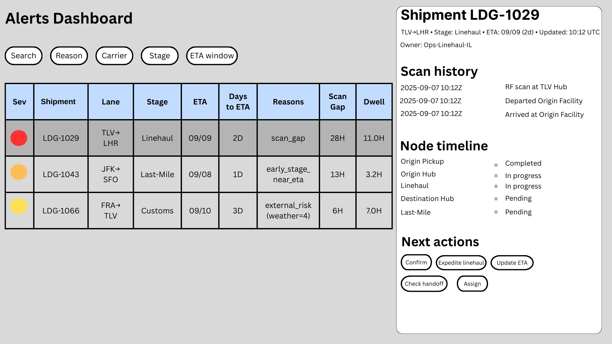

# Section 2 — Alerts Dashboard (LogiDog)

## 2.1 Screen (visuals)

A single-screen dashboard showing **at-risk shipments** with search/filters and clear visual indicators.  
(Embedded screenshot below: main list view with right-side details drawer.)



- **Main list view:** severity, shipment/lane, stage, ETA, days→ETA, reason chips, scan gap, dwell, owner, last updated.
- **Details drawer (on row click):** scan history, node timeline, and suggested next actions (assign owner, ack, expedite, update ETA).

---

## 2.2 Real-time approach — WebSockets

We will use a **WebSocket (WSS)** channel for near real-time updates (<1–2s).

**Why it fits this system:**

- **Bi-directional:** the UI can both **receive** alert changes and **send** user actions (Ack/Assign) over the same connection.
- **Efficient:** one persistent connection per client; the server pushes only **deltas** (changed rows), avoiding periodic polling.
- **Responsive UX:** instant “Updated just now” feedback without waiting for the next poll.

**Client flow (brief):**
open `wss://api.logidog/alerts` with auth → initial **snapshot** → **delta** messages for inserts/updates/deletes;  
if WSS is unavailable, **fall back** to incremental HTTP polling.

**Example message:**

```json
{
  "type": "delta",
  "op": "upsert",
  "ts": "2025-09-07T10:13:00Z",
  "row": {
    "shipment_id": "LDG-1029",
    "severity": "high"
  }
}
```

---

## 2.3 Data schema for the view (denormalized) — example

The dashboard consumes a **denormalized view model** per row to avoid heavy joins and keep rendering fast. The backend can maintain normalized storage and derive this view.

```json
{
  "shipment_id": "LDG-1029",
  "lane": "TLV→LHR",
  "stage": "Linehaul",
  "eta_planned": "2025-09-09T18:00:00Z",
  "days_to_eta": 2,
  "severity": "high",
  "reason_code": ["scan_gap", "excess_dwell"],
  "scan_gap_hours": 28,
  "dwell_hours_current": 11.0,
  "baseline_90pct_hours": 9.8,
  "external": { "weather_index": 2, "port_congestion": 3 },
  "current_carrier_name": "DHL Express",
  "owner": "Ops-Linehaul-IL",
  "last_update_ts": "2025-09-07T10:12:00Z"
}
```

_Notes:_

- All times UTC.
- Severity is derived from rules/thresholds in Section 1 (and can be tuned per lane/facility).
